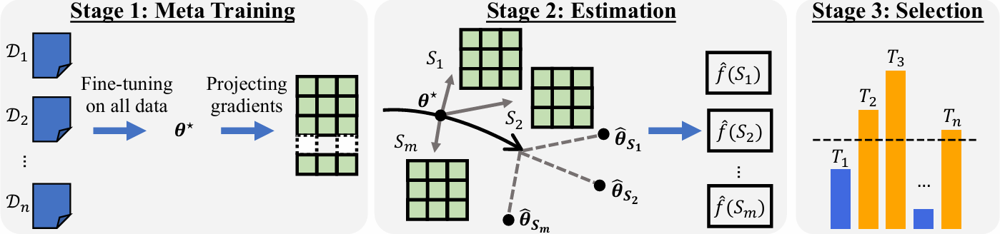

# Scalable Fine-tuning from Multiple Data Sources: A First-Order Approximation Approach (EMNLP 2024)
- Authors: [Dongyue Li](https://lidongyue12138.github.io/), [Ziniu Zhang](https://ziniuzhang.github.io/), [Lu Wang](https://web.eecs.umich.edu/~wangluxy/) and [Hongyang R. Zhang](https://www.hongyangzhang.com/)
- Paper: [arXiv]()



## Overview

This code provides the implementation to conduct gradient-based (first-order) estimation for fine-tuned language models. The experiments involve intruction fine-tuning and chain-of-thought fine-tuning. 

This project has been accepted by EMNLP 2024 Finding. Paper link is [here]().

### Requirements

To build up the environment, please run following commands.

```bash
conda create -n sfmd python=3.10
conda activate sfmd
pip install -r requirements.txt 
pip3 install --pre torch torchvision torchaudio --index-url https://download.pytorch.org/whl/nightly/cu124  # check the correct version for pytorch nightly about CUDA
mkdir ./data
mkdir ./results
mkdir ./external_lightning_logs
python setup.py develop
```

### Data Preparation

**Instruction fine-tuning**. Please refer to the open instruct repository for downloading the instruction fine-tuning data:

- FLAN v2
- COT

After downloading, save the data set as pickle file under the `./data/alpaca_data` folder.  For example: 

```python
from datasets import load_dataset
import pandas as pd

flan_dataset = load_dataset("json", data_files="./raw_train/tulu_v1_resampled_flan_100k.jsonl")["train"]

def reformat_flan(example):
    prompt = example["inputs"]
    if not prompt.endswith("\n") and not prompt.rstrip().endswith(":"):
        prompt += "\n"
    completion = example["targets"]
    example['text'] = prompt + completion
    example['skill'] = example['_task_name']
    return example

flan_dataset_df = flan_dataset.map(reformat_flan)
pd.to_pickle(flan_dataset_df, "./flan_dataset.pkl")
```

- Alpaca: Download the data from [this link](https://github.com/HazyResearch/skill-it/blob/main/aux_data/alpaca_final.pkl) and put the pickle file under the `./data/alpaca_data` folder.  

**Chain-of-thought fine-tuning.** Please refer to the [reasoning teacher repository](https://github.com/itsnamgyu/reasoning-teacher) for downloading the chain-of-thought data, including CommonsenseQA and StartegyQA. 

### Usage

Our algorithm contains four steps:

1. **Meta-training**: This fine-tune a language model on the combination of all tasks:

Use `custom_train.py` to fine-tune LMs on the chain-of-thought data. For example

```bash
python custom_train.py --dataset_key strategy_qa --model_key flan_t5_base --train_key ft_cot \
    --preset_key ft_cot_t70_64aug --devices 1 --batch_size 8 --inference_batch_size 32 \
    --train_lora --lora_rank 16 --lora_alpha 128 --runs 8
```


Use `custom_train_alpaca.py` to fine-tune LMs on the instruction fine-tuning data. For example:

```bash
python custom_train_alpaca.py --train_instruction --model_key TinyLlama/TinyLlama-1.1B-intermediate-step-1431k-3T\
    --lr 2e-5 --batch_size 128 --max_length 256 --epochs 10\
    --train_lora --lora_rank 128 --lora_alpha 512\
    --strategy fsdp --devices 0 1 2 3 --runs 1 --precision 16 --accumulate 1
```

2. **Compute the projected gradients** on each training data sample of all tasks. 

For *chain-of-thought fine-tuning*, use `fast_estimate_compute_gradients.py`. 

- Specify `--project_dim` as the number of projections. 
- Use `--load_model_dir` to specify a saved checkpoint directory as the base model. 

This file will save the projection matrix and all projected gradients under a `./gradients/` folder. Please create the folder before usage. 

```bash
python fast_estimate_compute_gradients.py --dataset_key strategy_qa --model_key flan_t5_base --preset_key ft_cot_t70_64aug\
			--load_model_dir flan_t5_base_strategy_qa_ft_cot_t70_64aug_lora_r_16_new_run_0/epoch_epoch=17\
     --train_lora --lora_rank 16 --lora_alpha 128 \
     --run 0 --project_dim 100 --device 2 
```

For *instruction fine-tuned model*, use `fast_estimate_eval_approximation_alpaca.py`. Use `--compute_pretrained_outputs` to compute the gradients. The parameters would be the similar as above. 

3. **Estimation based on linear regression on gradients** to estimate the output of model fine-tuned on a subset of tasks. 

For *chain-of-thought fine-tuning*, use `fast_estimate_linear_model.py`. 

- Specify `--save_name` for the file to save the evaluation results of estimated models. 
- Specify `--number_of_subsets` and `--subset_size` to control the number and size of sampled subsets

Inside the file, one can modify the subsets collection file under `./sampled_tasks/` to specify the sampled subsets of tasks. Usually, it should be randomly sampled subsets. 

```bash
python fast_estimate_linear_regression.py --dataset_key strategy_qa --model_key flan_t5_base --preset_key ft_cot_t70_64aug\
    --load_model_dir flan_t5_base_strategy_qa_ft_cot_t70_64aug_lora_r_16_new_run_0/epoch_epoch=17\
    --train_lora --lora_rank 16 --lora_alpha 128 \
    --run 0 --project_dim 100 --device 1 \
    --load_clusters --num_clusters 100 --number_of_subsets 1000 --subset_size 0.5 --scale 0.4
```

For *instruction fine-tuned model*, use `fast_estimate_linear_regression_alpaca.py`.  The parameters would be the similar as above. 

4. **Selection**: 

- Forward selection: Use `fast_estimate_forward_selection.py` to conduct greedy forward selection to select a subset of data
- Random ensemble: Please refer to `./notebook/select_random_ensemble.py` for an example of estimating random ensemble scores and thresholding the scores for selection. 

## Reference
If you find this repository useful or happen to use it in a research paper, please our work with the following bib information

```
@article{Li2023scalable,
  title={Scalable Fine-tuning from Multiple Data Sources: A First-Order Approximation Approach},
  author={Li, Dongyue and Zhang, Ziniu and Wang, Lu and Zhang, Hongyang},
  journal={EMNLP},
}
```